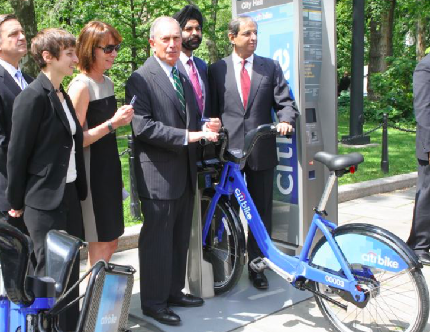
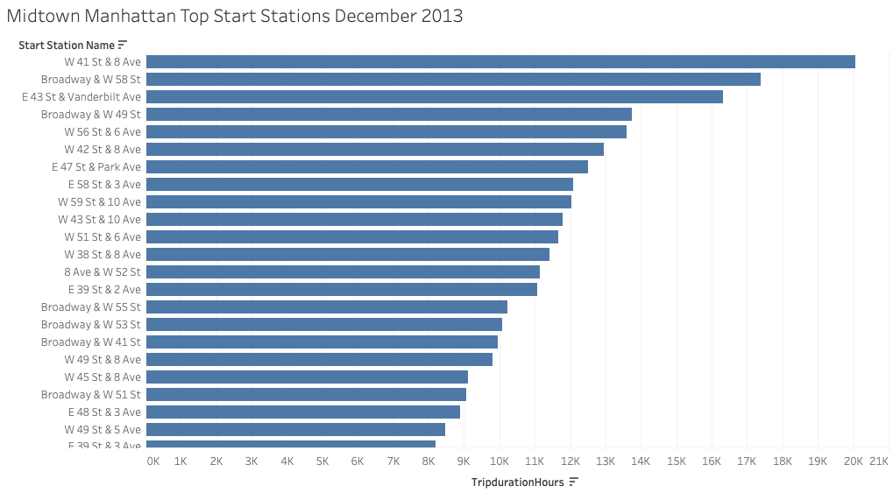
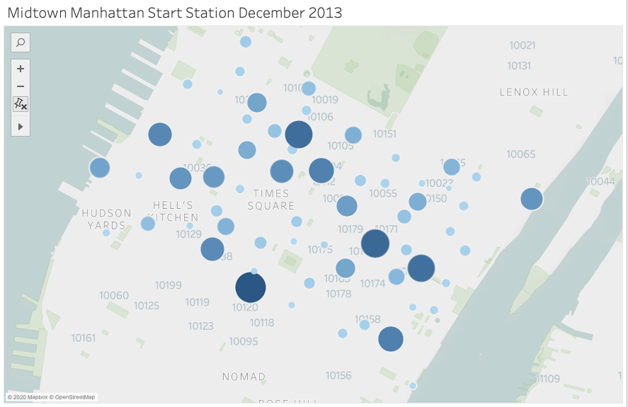
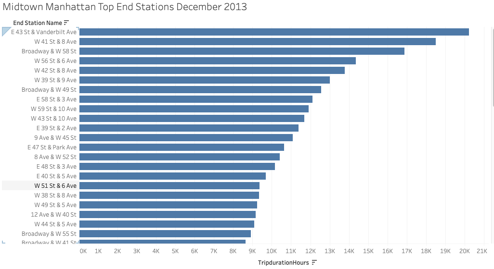
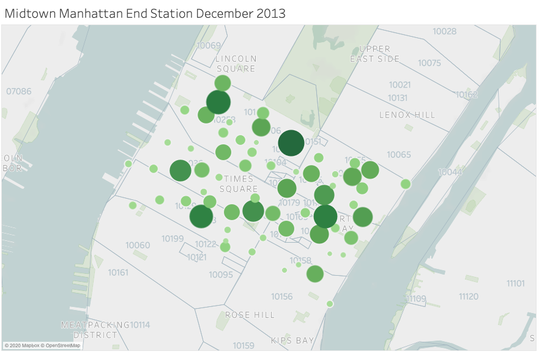

# Midtown Manhattan Citi Bike Analysis December 2013

The follwing is an analysis on CitiBike data for the month of June 2013.  
The data will analyze CitiBike usage during Michael Bloomerg's last month in office. 
https://public.tableau.com/profile/kevin.kleyman#!/

### December 2013 Start Station By Trip Duration:

The graph illustrates the top 20 stations where CitiBike rides were started in June 2013.  
The first two stations with the most total hours for all rides were in Midtown West.  
The locations are mainly near Port Authority, Central Park and Grand Central. 

* `West 41st Street and 8th Avenue` (Port Authority)
* `Broadway and West 58th Street` (Central Park)
* `East 43rd Street and Vanderbilt Avenue` (Central Park)
* `Broadway and West 49th Street` (Grand Central)
* `West 56th Street and 6th Avenue` (Central Park) 
  

### Michael Bloomberg End Station By Trip Duration:

The graph illustrates the top 20 stations where Citi Bike rides ended in December 2013, during Michael Bloomberg's last month in office. 
The top stations with the most hours duration were the Central Park, Grand Central and Port Authority stations.  

* `East 43rd Street and Vanderbilt Avenue` (Grand Central)
* `West 41st Street and 8th Avenue` (Port Authority)
* `Broadway and West 58th Street` (Central Park)
* `West 56 Street and 6th Avenue` (Central)
* `West 42nd Street and 8th Avenue` (Port Authority)
 

